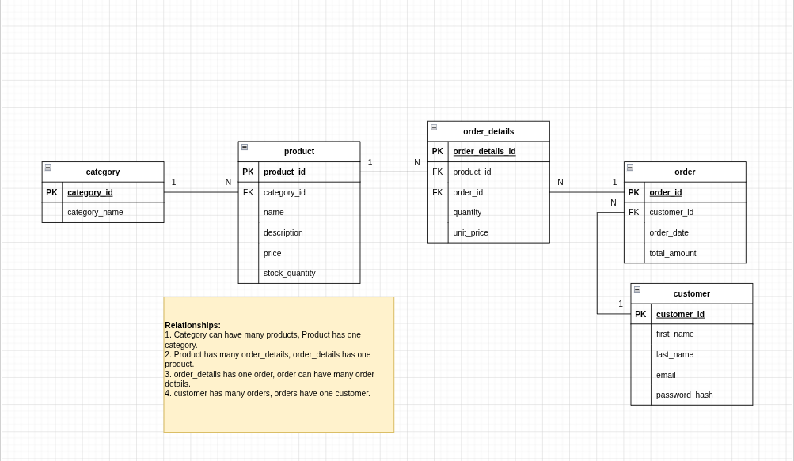
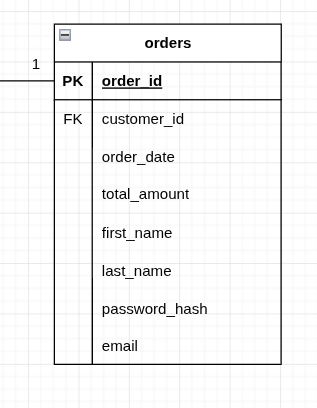
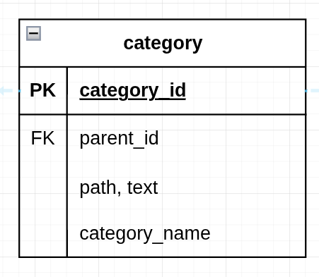

# Explanation

An e-commerce schema built with MySQL + [Kysely](https://kysely.dev/) + [`kysely-ctl`](https://github.com/kysely-org/kysely-ctl). Migrations and seeds live under `sql/`, schema types under `src/types.ts`.

## Table of Contents

- [Explanation](#explanation)
  - [Table of Contents](#table-of-contents)
  - [Running the project](#running-the-project)
    - [1. Install packages](#1-install-packages)
    - [2. Start MySQL (Docker)](#2-start-mysql-docker)
    - [3. Run migrations](#3-run-migrations)
    - [4. Run seeds](#4-run-seeds)
    - [5. Reset state](#5-reset-state)
  - [SQL Exercises](#sql-exercises)
    - [EX1 — Daily revenue report (src/sql-exercises/ex1.ts)](#ex1--daily-revenue-report-srcsql-exercisesex1ts)
    - [EX2 — Monthly top-selling products (src/sql-exercises/ex2.ts)](#ex2--monthly-top-selling-products-srcsql-exercisesex2ts)
    - [EX3 — High-value customers (src/sql-exercises/ex3.ts)](#ex3--high-value-customers-srcsql-exercisesex3ts)
    - [EX4 — Full-text product search (src/sql-exercises/ex4.ts)](#ex4--full-text-product-search-srcsql-exercisesex4ts)
    - [EX5 — Product recommendations by category (src/sql-exercises/ex5.ts)](#ex5--product-recommendations-by-category-srcsql-exercisesex5ts)
  - [ERD](#erd)
  - [Challenges](#challenges)
    - [How we can apply a denormalization (uglification) mechanism on customer and order tables?](#how-we-can-apply-a-denormalization-uglification-mechanism-on-customer-and-order-tables)

## Running the project

### 1. Install packages

```bash
pnpm install --frozen-lockfile
```

### 2. Start MySQL (Docker)

```bash
docker compose up -d
```

Then copy env vars once:

```bash
cp .env.example .env
```

Defaults match `docker-compose.yml` (`root` / `password` / `test_db` on `localhost:3306`).

### 3. Run migrations

```bash
pnpm kysely migrate:latest         # apply all pending
pnpm kysely migrate:up             # apply the next one
pnpm kysely migrate:down           # revert the last one
pnpm kysely migrate:list           # show status
pnpm kysely migrate:make <name>    # scaffold a new migration
```

### 4. Run seeds

Populates the DB with faker-generated data (categories, customers, products, orders, order details).

```bash
pnpm kysely seed:run                   # run with defaults (~415k rows)
pnpm kysely seed:make <name>           # scaffold a new seed file
```

Scale via env vars (see top of `sql/seeds/*.ts`):

```bash
SEED_CUSTOMERS=1000000 \
SEED_ORDERS=5000000 \
SEED_PRODUCTS=50000 \
pnpm kysely seed:run
```

### 5. Reset state

Pick your level of scorched-earth:

**a. Roll back migrations** (keeps container + volume)
```bash
pnpm kysely migrate:rollback --all
```

**b. Drop & recreate the database** (fastest full wipe)
```bash
docker exec -i mysql-development mysql -uroot -ppassword \
  -e "DROP DATABASE IF EXISTS test_db; CREATE DATABASE test_db;"
pnpm kysely migrate:latest
```

**c. Nuke Docker + volume** (pristine MySQL instance)
```bash
docker compose down -v
docker compose up -d
pnpm kysely migrate:latest
```

## SQL Exercises

Each exercise is in `src/sql-exercises/` and implements the query **two ways**: raw SQL and the Kysely query builder. Requires a running DB with migrations + seeds applied.

---

### EX1 — Daily revenue report ([src/sql-exercises/ex1.ts](src/sql-exercises/ex1.ts))

> Generate the total revenue for a specific date.

```sql
SELECT
    SUM(total_amount) AS total_revenue
FROM
    orders
WHERE
    order_date >= '2025-08-13'
    AND
    order_date < '2025-08-14';
```

```bash
pnpm ex1
```

---

### EX2 — Monthly top-selling products ([src/sql-exercises/ex2.ts](src/sql-exercises/ex2.ts))

> List products ranked by units sold in a given month.

```sql
SELECT product.uuid, product.name, SUM(order_details.quantity) AS total_units_sold
FROM order_details
JOIN product ON order_details.product_uuid = product.uuid
JOIN orders ON order_details.order_uuid = orders.uuid
WHERE
    orders.order_date >= '2025-08-01'
    AND
    orders.order_date < '2025-09-01'
GROUP BY
    product.uuid,
    product.name
ORDER BY
    total_units_sold DESC;
```

```bash
pnpm ex2
```

---

### EX3 — High-value customers ([src/sql-exercises/ex3.ts](src/sql-exercises/ex3.ts))

> Customers who spent more than $500 in the past month, top 10.

```sql
SELECT
    customer.uuid,
    customer.first_name,
    customer.last_name,
    SUM(orders.total_amount) AS total_amount_per_customer
FROM
    customer
JOIN
    orders
ON
    customer.uuid = orders.customer_uuid
WHERE
    orders.order_date >= '2026-03-01'
    AND
    orders.order_date < '2026-04-01'
GROUP BY
    customer.uuid,
    customer.first_name,
    customer.last_name
HAVING
    total_amount_per_customer > 500
ORDER BY
    total_amount_per_customer DESC
LIMIT 10;
```

```bash
pnpm ex3
```

---

### EX4 — Full-text product search ([src/sql-exercises/ex4.ts](src/sql-exercises/ex4.ts))

> Search for all products with a given word in either the product name or description using MySQL full-text search.

```sql
SELECT product.uuid, product.name, product.description
FROM product
WHERE MATCH (name, description)
AGAINST ('computer')
LIMIT 5;
```

```bash
pnpm ex4
```

---

### EX5 — Product recommendations by category ([src/sql-exercises/ex5.ts](src/sql-exercises/ex5.ts))

> Recommend popular products in a specific category that were **not** purchased by a given customer, ranked by total units sold.

```sql
SELECT product.uuid, product.name, product.description,
       category.uuid AS category_uuid, category.name AS category_name,
       SUM(order_details.quantity) AS purchase_count
FROM product
JOIN category ON product.category_uuid = category.uuid
JOIN order_details ON order_details.product_uuid = product.uuid
WHERE product.uuid NOT IN(
    SELECT product.uuid
    FROM order_details
    JOIN orders ON orders.uuid = order_details.order_uuid
    JOIN customer ON customer.uuid = orders.customer_uuid
    WHERE customer.uuid = '0x00003E4A59A1467EA0DB8A29B9167F6C'
      AND product.category_uuid = '0x138C41CB5AA84A86827E067A27114E29'
)
  AND category.uuid = '0x138C41CB5AA84A86827E067A27114E29'
GROUP BY product.uuid, category.uuid
ORDER BY purchase_count DESC;
```

```bash
pnpm ex5
```

## ERD


## Challenges

### How we can apply a denormalization (uglification) mechanism on customer and order tables?


### Hierarchical Categories


<!-- #### Create a category with a parent
```sql

``` -->

#### Read the full category tree / subtree

```sql
SELECT * FROM category WHERE path LIKE '/31d09fb6175943c88b6fef72c2f680a9%'
```
<!-- 
#### Update a category's parent

```sql
UPDATE category
SET parent_uuid = 'some_parent_uuid'
WHERE uuid = 'some_child_uuid';

UPDATE category
SET path = REPLACE(path, 'old_parent_uuid/child_uuid', 'new_parent_uuid/child_uuid')
WHERE path LIKE 'old_parent_uuid/child_uuid%';
``` -->
<!-- 
#### Delete a category (and handle children)
```sql

``` -->